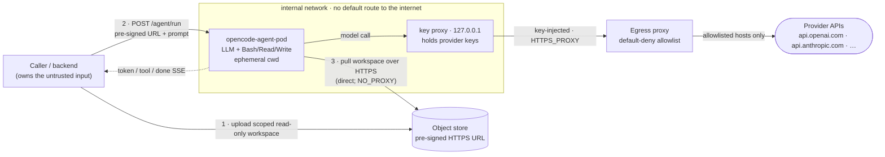

# Deployment

How to build and run the pod as a container, and how to apply the network egress control that the
pod process cannot enforce itself.

> **Prototype note.** This describes the *target* deployment shape; none of it is currently
> applied to a live environment — the pod runs on a dev host for showcase purposes. So the egress
> policy below is written and reviewed but **not exercised**. Workspace transport now supports a
> network `https://` pull (object store / pre-signed HTTPS URL) so the LLM sandbox shares no disk
> with the backend — the mode to use across a trust boundary; local `file://` staging remains for
> single-host dev, where it **assumes the caller and pod share a filesystem**. "Complete isolation"
> still requires applying the egress policy below (and a separate network namespace from the
> backend) in a real deployment. See DESIGN → Scope, §4, and §11.

## Isolated topology

The fully decoupled shape: the pod runs in its own container on an `internal` network with no
default route to the internet, the workspace arrives over the network (never a shared disk), and
outbound traffic is confined to allowlisted provider hosts by a proxy the pod cannot bypass. The
key proxy on `127.0.0.1` holds the provider keys and injects them into model calls, so neither the
daemon nor its `Bash` children ever see a key.



Everything not on that allowlist — an LLM-authored `Bash` script opening a socket to an arbitrary
host — is dropped by the egress proxy, so staged data cannot be exfiltrated. The pod reaches the
object store and its own loopback key proxy directly (`NO_PROXY`); only provider traffic transits
the egress proxy. A worked, verified instance of this topology lives in the consumer repos
(`../BGP-LLaMA-webservice/docker-compose.pod.yml`, `../ai-customs/docker-compose.agent.yml`); the
BGP one was run end to end on 2026-07-14 (a real run pulled its workspace from the object store and
reached the provider only through the egress proxy).

## Build & run the image

The `Dockerfile` bundles the FastAPI/SSE service with a pinned `opencode` binary (`OPENCODE_VERSION`,
default 1.17.18) and the Node runtime opencode needs.

```bash
# Build (add --platform linux/amd64 when the target host is x86).
docker build -t opencode-agent-pod:dev .

# Run. AGENT_POD_TOKEN is required — the pod refuses every request (503) without it. Provider keys
# are passed as env/secrets; the key proxy keeps them out of the daemon and its Bash children, so
# handing them to the pod process is the intended, safe path.
docker run --rm -p 8080:8080 \
  -e AGENT_POD_TOKEN=$POD_TOKEN \
  -e ANTHROPIC_API_KEY=$ANTHROPIC_API_KEY \
  opencode-agent-pod:dev
```

`GET /health` answers `{"status":"ok"}` once up. All other config is `AGENT_POD_*` env (see
`pod/settings.py`); the container binds `0.0.0.0` and runs as a non-root user.

Runtime config worth knowing:

- **`AGENT_POD_TOKEN`** (required) — the shared bearer token; unset means fail-closed (503).
- **Provider keys** (`ANTHROPIC_API_KEY`, `OPENAI_API_KEY`, …) — mount as secrets, never bake into a
  layer. The key proxy is on by default (`AGENT_POD_KEY_PROXY=1`).
- **Budget/turn/timeout caps** — `AGENT_POD_MAX_BUDGET_USD`, `AGENT_POD_MAX_TURNS`,
  `AGENT_POD_SESSION_TIMEOUT`.
- **Remote workspace staging** — `AGENT_POD_WORKSPACE_MAX_BYTES` (download + expanded-archive cap,
  default 2 GiB), `AGENT_POD_WORKSPACE_FETCH_TIMEOUT` (seconds, default 60), and
  `AGENT_POD_WORKSPACE_HOST_ALLOWLIST` (comma-separated hosts a `https://` workspace source may
  point at; empty = any https host — link-local/metadata addresses are always refused). Pin it to
  your object-store host as defense-in-depth alongside the egress allowlist below.
- **`AGENT_POD_WORKSPACE_TLS_VERIFY`** — verify the storage host's TLS cert when pulling a remote
  workspace (default on). Set `0` **only** to accept a self-signed cert from trusted local storage
  (e.g. a dev MinIO on the same host); a warning is logged on every fetch when off. Production keeps
  it on with a valid certificate.

A worked example of the fully isolated deployment — the pod in its own container on an `internal`
network, MinIO as neutral workspace storage, and this egress allowlist enforced by a proxy sidecar
— lives in the consumer repos (`../BGP-LLaMA-webservice/docker-compose.pod.yml`,
`../ai-customs/docker-compose.agent.yml`).

**Custom (vLLM) providers and egress:** opencode installs `@ai-sdk/*` packages from the npm registry
on first use of a custom OpenAI-compatible provider. The egress allowlist below blocks that, so
either pre-warm the package at build time or allow the npm registry for those deployments. The
catalog GPT/Anthropic path bundles its SDKs in the binary and needs no runtime install.

## Egress control for the `Bash` tool

This is the deploy-time half of the pod's security posture (DESIGN §11). The in-process key-injecting
proxy (DESIGN §7, `pod/key_proxy.py`) already removes provider keys from the daemon and its `Bash`
children, so a run can no longer read a key. What remains is a network concern the pod process cannot
enforce from Python: an LLM-authored `Bash` script could still open its own socket to an arbitrary
host and exfiltrate the workspace data it was given. Blocking that is an egress allowlist applied to
the container/host the pod runs in.

The pod does not implement this itself on purpose: a firewall enforced by the same process that runs
the untrusted code is not a real boundary. Enforce it one layer out, at the network.

## What to allow

Deny all outbound traffic by default, then allow exactly:

1. **The provider hosts the pod actually calls** — the upstreams the proxy forwards to:
   - `api.anthropic.com`
   - `api.openai.com`
   - `generativelanguage.googleapis.com`
   - `api.x.ai`
   - plus the host of any custom provider declared in `AGENT_CUSTOM_PROVIDERS`.
2. **Loopback** (`127.0.0.1`) — the daemon reaches the key proxy here; keep it host-local.
3. **DNS** to your resolver, if the allowlist is by hostname.

Everything else — outbound to arbitrary IPs/hosts — is denied. Model traffic keeps working because
it flows daemon → `127.0.0.1` proxy → allowlisted provider host; an exfiltration attempt to an
unlisted host is dropped.

Keep the proxy bound to `127.0.0.1` (`AGENT_POD_KEY_PROXY_HOST`, the default). It holds the real
keys and must never be reachable off-host, regardless of how the pod's own listener binds.

## Docker

Run the pod on an internal network with no default route to the internet, and reach providers
through an egress gateway/proxy that only forwards the allowlisted hosts:

```bash
docker network create --internal pod-internal
# The pod has no direct egress; an egress-proxy sidecar on both networks forwards only allowed hosts.
docker run --network pod-internal --name pod opencode-agent-pod
```

Or, with host firewalling, restrict the container's outbound set with `iptables`/`nftables` to the
provider IP ranges + loopback and drop the rest (owner-match the container's uid/netns).

## Kubernetes

A default-deny egress `NetworkPolicy`, opened only for DNS and the provider hosts (via an
allowlisting egress proxy or a CIDR set for the provider ranges):

```yaml
apiVersion: networking.k8s.io/v1
kind: NetworkPolicy
metadata:
  name: pod-egress-allowlist
spec:
  podSelector:
    matchLabels: { app: opencode-agent-pod }
  policyTypes: ["Egress"]
  egress:
    - to: []                       # DNS
      ports: [{ protocol: UDP, port: 53 }, { protocol: TCP, port: 53 }]
    - to:                          # provider CIDRs, or route via an allowlisting egress gateway
        - ipBlock: { cidr: 0.0.0.0/0 }   # replace with the provider ranges / gateway address
      ports: [{ protocol: TCP, port: 443 }]
```

Plain hostname allowlists aren't expressible in vanilla `NetworkPolicy` — use a CNI that supports
FQDN policies (Cilium `toFQDNs`) or route all egress through an allowlisting forward proxy and deny
everything else.

## Verifying

With the policy applied, a `Bash` run that tries to reach an unlisted host (e.g.
`curl https://example.com`) should fail/time out, while a normal model run still completes. The
key-custody half is independently checked by `scripts/key_proxy_probe.py`.
