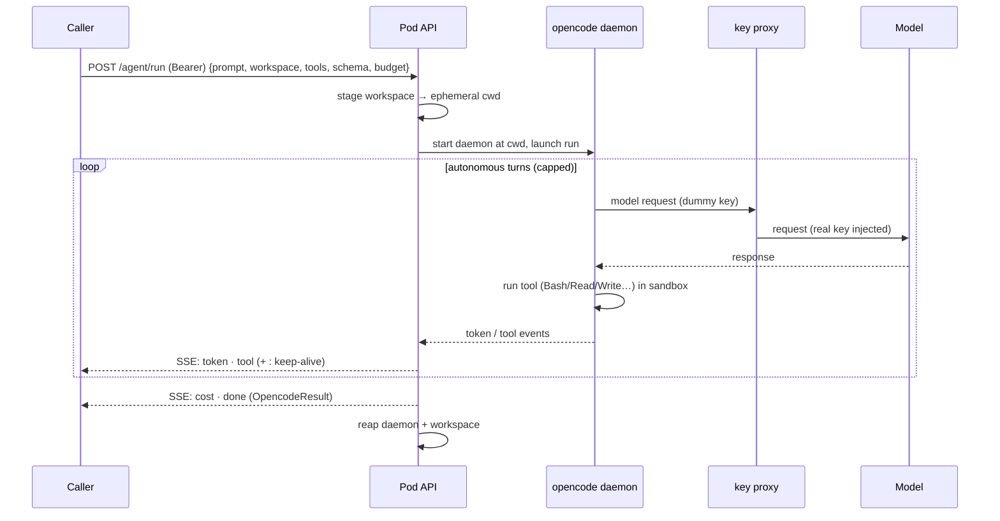

# opencode-agent-pod

A small, deployable container that runs **one fully autonomous [opencode](https://opencode.ai) agent
per request** behind an HTTP + SSE API. A calling service POSTs a task — a prompt, a workspace
pointer, a tool allow-list, an optional output schema — and gets back the agent's live
reasoning/tool trace and a final result. The pod bundles the opencode runtime, the daemon lifecycle,
a code-executing sandbox, and the provider keys, so the caller embeds none of that.

```
(prompt, workspace, tools, model, schema, budget)  →  streamed events  →  final result
```

## Why this exists

opencode is an excellent agent runtime — native tools (`Read`, `Write`, `Edit`, `Bash`, `Glob`,
`Grep`) plus MCP, a real tool loop, structured output — but it is built for a **human in the loop**.

Most steps in an autonomous pipeline are cheap, deterministic, and belong in plain code. Occasionally
one step needs an agent that can *write a script, run it, read the output, and fix itself* — unattended,
in an **isolated sandbox**. This pod is that one step, extracted into a service so you don't rebuild
the opencode binary, daemon lifecycle, key custody, and sandbox in every caller:

- **Autonomous, not interactive** — one request is one self-contained run that loops as many turns as
  it needs, streaming its reason → execute → observe trace.
- **Native tools + MCP, sandboxed** — real `Bash`/`Read`/`Write` and any MCP servers you register, run
  against a per-request throwaway workspace, not your host.
- **Keys never cross the boundary** — provider keys stay inside the pod; callers send prompts and get
  results, never a key (see [Security](#security)).
- **Reusable** — the pod knows nothing domain-specific, so one container serves any caller (see
  [Who uses it](#who-uses-it)).

## The core idea: a stateless compute primitive

The pod is closer to a serverless function than to a stateful service. Every request is
self-contained; any pod can serve any request; a pod crashing loses nothing recoverable. There is
**no session table, no workspace cache, no conversation history** in the pod. Everything stateful and
domain-specific lives one layer up, in the caller.

| The pod owns (stateless compute)            | The caller owns (state + domain)                  |
| ------------------------------------------- | ------------------------------------------------- |
| opencode binary + daemon lifecycle          | Caching / provisioning the workspace              |
| The agent loop: run → stream → result       | Conversation history / prior findings             |
| Per-request **ephemeral** workspace + reap  | Domain logic (which prompt / tools / schema)      |
| Sandbox, permissions, egress for the run    | Building the workspace contents                   |
| **Provider keys** (the custody boundary)    | End-user identity / auth                          |

**Multi-turn without sessions.** Continuity works the way the OpenAI/Anthropic chat APIs do — the
caller carries state forward. The workspace is carried as a *reference* (never re-uploaded); the
conversation is carried as **distilled prior findings** (the previous run's structured output or a
compact summary), not the raw transcript. Structured output is the natural memory unit: each run
concludes with a clean object; the next run's prompt gets `prior findings: {…}`.

**Workspace by reference.** `workspace` is a *pointer* to where the caller already put the run's
data, not the bytes themselves:

```json
"workspace": { "source": "file:///data/run-42", "mode": "ro" }
```

The caller stages the files (BGP dumps, documents, a repo) and passes the location; the pod copies it
into a throwaway working directory, runs the agent there, and deletes it when the run ends — reading
fresh each time, owning nothing after. (v1 stages `file://` and local paths; `s3://` is the extension
point.)

## Architecture


Per request the pod starts a **dedicated daemon** bound to that run's ephemeral workspace, so one
caller's `Bash`/`Read` can never reach another's files, and reaps both the daemon and the workspace
when the run ends (even on client disconnect). The model call leaves the daemon carrying a *dummy*
key and is routed through the in-process proxy, which injects the real key on egress — so no provider
key ever enters the shell the agent can run.

### One run, end to end



## API

### `POST /agent/run` — bearer token required

```jsonc
{
  "model":            "anthropic/claude-haiku-4-5-20251001", // or a custom OpenAI-compatible id
  "system_prompt":    "…",                                   // optional
  "prompt":           "…",                                   // the task
  "tools":            ["Read", "Bash", "Write"],             // from the tool registry (empty = plain inference)
  "response_schema":  { "…": "JSON Schema" },                // optional → structured output
  "reasoning_effort": "low|medium|high|max",                 // optional
  "max_budget_usd":   0.50,                                  // hard per-request breaker (clamped to pod ceiling)
  "workspace":        { "source": "file:///data/run-42", "mode": "ro" } // optional
}
```

Responds `200 text/event-stream`:

| event         | payload                                                                    |
| ------------- | -------------------------------------------------------------------------- |
| `token`       | an assistant-text delta                                                    |
| `tool`        | a tool call's `name` / `status` / `input`, and `output` once it finishes   |
| `: keep-alive`| a comment line while the run is idle, so intermediaries don't time out     |
| `cost`        | running spend                                                              |
| `done`        | the terminal `OpencodeResult` (below)                                      |

The `done` event carries the result contract:

| field               | meaning                                                                     |
| ------------------- | --------------------------------------------------------------------------- |
| `text`              | free-text final answer                                                      |
| `structured_output` | validated object when a `response_schema` was requested                     |
| `total_cost_usd`    | aggregate spend for the run                                                 |
| `duration_ms`       | wall-clock                                                                  |
| `num_turns`         | internal agent turns taken                                                  |
| `subtype`           | `success` / `max_turns` / `error_timeout` / `error_max_budget_usd` / `error`|
| `is_error`          | whether the caller should treat the run as failed                          |

A tool-less run (no `tools`, no `workspace`) is legal — it degrades to plain inference, though in that
mode opencode buys little over a direct provider SDK call; the pod's value is the *agentic* path.

### `GET /health`

`{"status": "ok"}` once the service is up.

## Quick start

Requires the `opencode` binary on `PATH` (the Docker image bundles a pinned version) and a provider
key. `AGENT_POD_TOKEN` is **required** — the pod fails closed (503) without it.

```bash
# Local (Python 3.12) — auto-loads .env
cp .env.example .env          # set AGENT_POD_TOKEN + a provider key (e.g. ANTHROPIC_API_KEY)
python -m venv .venv && .venv/bin/pip install -r requirements.txt
.venv/bin/python -m pod       # serves on :8080

# Docker
./run_pod.bash                # build + run, waits for /health
# or manually:
docker build -t opencode-agent-pod:dev .
docker run --rm -p 8080:8080 \
  -e AGENT_POD_TOKEN=$POD_TOKEN -e ANTHROPIC_API_KEY=$ANTHROPIC_API_KEY \
  opencode-agent-pod:dev
```

Smoke test:

```bash
curl -N -X POST http://localhost:8080/agent/run \
  -H "Authorization: Bearer $AGENT_POD_TOKEN" -H 'Content-Type: application/json' \
  -d '{"model": "anthropic/claude-haiku-4-5-20251001", "prompt": "Say hello."}'
```

## Configuration

All config is `AGENT_POD_*` environment variables (nothing hardcoded):

| Variable                       | Default     | Purpose                                                       |
| ------------------------------ | ----------- | ------------------------------------------------------------- |
| `AGENT_POD_TOKEN`              | *(unset)*   | Shared bearer token. **Required** — unset ⇒ every request 503 |
| `AGENT_POD_MAX_BUDGET_USD`     | *(none)*    | Hard ceiling clamped onto every run's budget                  |
| `AGENT_POD_DEFAULT_BUDGET_USD` | *(none)*    | Budget used when a request names none                         |
| `AGENT_POD_SESSION_TIMEOUT`    | `900`       | Per-run wall-clock cap (seconds)                              |
| `AGENT_POD_MAX_TURNS`          | `30`        | Per-run internal turn cap                                     |
| `AGENT_POD_KEEPALIVE_SECONDS`  | `15`        | Interval between SSE keep-alive comments                      |
| `AGENT_POD_HOST` / `_PORT`     | `127.0.0.1` / `8080` | Listener bind                                        |
| `AGENT_POD_KEY_PROXY`          | `1`         | Key-injecting proxy on/off (leave on; off only for debugging) |
| `AGENT_POD_KEY_PROXY_HOST`     | `127.0.0.1` | Interface the proxy binds (keep host-local)                   |

Plus:

- **Provider keys** (`ANTHROPIC_API_KEY`, `OPENAI_API_KEY`, …) — pod-internal config, mounted as
  secrets; consumed by the key proxy, never returned.
- **`AGENT_CUSTOM_PROVIDERS`** — JSON array registering custom OpenAI-compatible providers (e.g. a
  local vLLM model): `[{"name":"vllm","base_url":"http://host:8000/v1","models":["llama-bgp"]}]`.
- **`AGENT_MCP_SERVERS`** — JSON array of `{name, command, tools}` registering MCP servers the agent
  may call. The pod bakes in none; domain tools are registered here, not in pod code.

## Security

A shared service that runs LLM-authored code against caller-supplied workspaces while holding every
provider key has a large blast radius. It is designed to start **internal and trusted-network**, not
public:

- **Bearer-gated**, fails closed when no token is configured.
- **Per-request budget cap** clamped to a pod ceiling — anyone who can call can spend.
- **Per-request workspace isolation + guaranteed reap** — a separate daemon per ephemeral workspace,
  torn down on completion *and* on client disconnect (no leak).
- **Key custody** — a key-injecting proxy holds the real keys in the pod process; the daemon (and any
  `Bash` child it spawns) carries only a dummy key, so a script cannot read a provider key.
- **Bash egress** — removing the key from the shell closes key theft; blocking *workspace-data*
  exfiltration to arbitrary hosts is a network concern the pod can't honestly enforce from Python. It
  is delivered as a deploy-time egress allowlist — see [DEPLOY.md](DEPLOY.md).

Full deployment guidance (image build, egress `NetworkPolicy`, single-tenant-worker scaling) is in
[DEPLOY.md](DEPLOY.md).

## Who uses it

The pod is domain-free; these are the motivating consumers, not dependencies:

- **BGP-LLaMA** — *strong fit.* A code-executing routing analyst: given "analyze prefix X over
  timerange Y", the backend stages scoped BGP data as the workspace, the agent writes an analysis
  script, **runs** it (`Bash`), reads output, self-corrects, and streams the trace to the browser.
  This is where the sandbox earns its keep.
- **ai-customs** — an agentic declaration cross-checker. In an eval on 30 real customs documents, the
  scripted pipeline handled the bulk and escalated the 8 valuation criticals it could flag but not
  resolve to one `POST /agent/run` each; the agent resolved all 8 (5 extraction artifacts, 3 real
  under-declarations), independently verified.

A typical integration: the caller renders its own prompt/schema, stages a `file://` workspace, POSTs
one run per unit of work with the bearer token, relays the pod's `token`/`tool` SSE frames to its own
UI, and threads the run's structured output forward as prior findings.

## Development

```bash
.venv/bin/python -m pytest tests/ -q      # unit tests (mirror agent/ and pod/)
.venv/bin/python -m ruff check .          # lint (line length 100; E,W,F,I,UP,B,C4)
.venv/bin/python -m mypy .                # types (pragmatic)
```

Conventions: Python 3.12, Ruff + mypy (see `pyproject.toml`), env-driven config, and a firm rule that
the pod stays **domain-free** — no BGP/customs/audit vocabulary in pod code. If a change would teach
the pod what a "timerange" or a "declaration" is, it belongs in a caller instead.

## Layout

```
opencode-agent-pod/
├── agent/              # the engine: OpencodeRunner (one autonomous run), the response contract,
│   └── opencode/       #   daemon lifecycle, client, driver, event/budget caps, provider+key map
├── pod/                # the service — FastAPI + SSE over the engine
│   ├── app.py          #   create_app: bearer auth, POST /agent/run, /health, lifespan drain
│   ├── service.py      #   budget resolution, runner assembly, the SSE generator, per-run reap
│   ├── workspace.py    #   stage workspace-by-reference → ephemeral cwd → reap
│   ├── key_proxy.py    #   key-injecting reverse proxy: real keys never enter the daemon
│   └── schema.py       #   RunRequest + JSON-Schema response pass-through
├── core/tools/mcp.py   # config-driven MCP registry (AGENT_MCP_SERVERS)
├── llm/                # provider/reasoning types, model resolution, retry config
├── tests/              # unit tests
├── Dockerfile          # deployable image (pinned opencode + the service)
└── DEPLOY.md           # deployment + egress hardening
```
