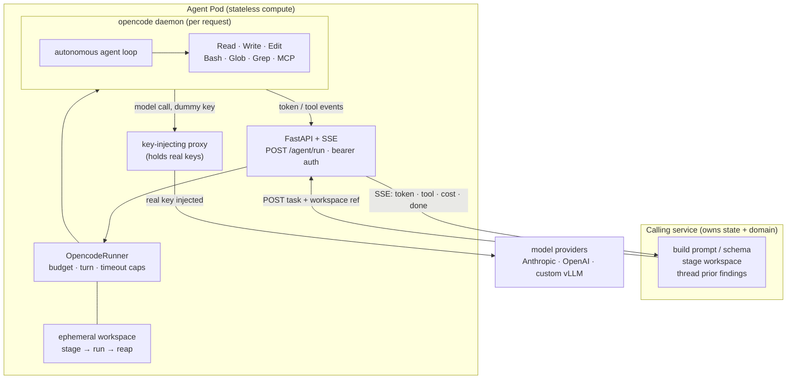
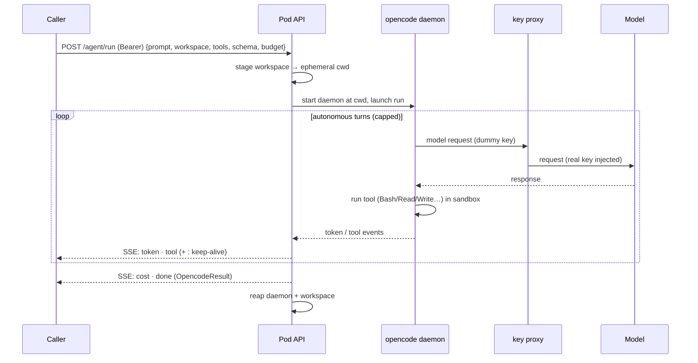

# OpenCode Agent Pod

Autonomous [opencode](https://opencode.ai) agents as a deployable HTTP service.


One request → one fully autonomous agent run → streamed trace + final result. The pod
bundles the opencode runtime, daemon lifecycle, sandbox, and provider keys so callers
embed none of that.

```
(prompt, workspace, tools, model, schema, budget)  →  streamed events  →  final result
```

## Why this exists

CLI agents like opencode and Claude Code are capable — native tools (`Read`, `Write`,
`Edit`, `Bash`, `Glob`, `Grep`), MCP, multi-turn loops, structured output — but built for
a human at a terminal.

This pod makes that capability **programmable**. POST a task; the agent plans, runs code,
reads output, and self-corrects on its own, streaming the trace back. Same toolset drives
coding *and* non-coding work (see [Who uses it](#who-uses-it)).

- **Autonomous** — one request is one self-contained run; no step-by-step approval.
- **Domain-free** — give it a prompt, tools, and staged data; the pod knows nothing about BGP or customs.
- **Sandboxed** — real tools + MCP against a per-request throwaway workspace.
- **Keys stay inside** — callers send prompts and get results, never a provider key.

## The core idea: a stateless compute primitive

Closer to a serverless function than a stateful service. Every request is self-contained;
any pod can serve any request; a crash loses nothing recoverable. **No session table, no
workspace cache, no conversation history** in the pod — all of that lives in the caller.

| The pod owns (stateless compute)   | The caller owns (state + domain)             |
| ---------------------------------- | -------------------------------------------- |
| opencode binary + daemon lifecycle | Caching / provisioning the workspace         |
| Agent loop: run → stream → result  | Conversation history / prior findings        |
| Ephemeral workspace + reap         | Domain logic (prompt / tools / schema)       |
| Sandbox, permissions, egress       | Building the workspace contents              |
| Provider keys (custody boundary)   | End-user identity / auth                     |

**Multi-turn without sessions.** Continuity works like the chat APIs: the caller carries
state forward. Pass the workspace as a *reference*; pass conversation as distilled prior
findings (structured output or a compact summary), not the raw transcript.

**Workspace by reference.** `workspace` is a pointer to data the caller already staged —
never the bytes themselves:

```json
"workspace": { "source": "file:///data/run-42", "mode": "ro" }
```

The pod copies it into a throwaway directory, runs the agent, and deletes it when the run
ends. (v1: `file://` and local paths; `s3://` is the extension point.)

## Architecture



Each request gets a **dedicated daemon** on an ephemeral workspace — one caller's tools
cannot reach another's files. Both are reaped when the run ends (including on client
disconnect). Model calls leave the daemon with a *dummy* key and route through an
in-process proxy that injects the real key on egress.

### One run, end to end



## API

### `POST /agent/run` — bearer token required

```jsonc
{
  "model":            "anthropic/claude-haiku-4-5-20251001", // or a custom OpenAI-compatible id
  "system_prompt":    "…",                                   // optional
  "prompt":           "…",                                   // the task
  "tools":            ["Read", "Bash", "Write"],             // from the tool registry (empty = plain inference)
  "response_schema":  { "…": "JSON Schema" },                // optional → structured output
  "reasoning_effort": "low|medium|high|max",                 // optional
  "max_budget_usd":   0.50,                                  // hard per-request breaker (clamped to pod ceiling)
  "workspace":        { "source": "file:///data/run-42", "mode": "ro" } // optional
}
```

Responds `200 text/event-stream`:

| event          | payload                                                                  |
| -------------- | ------------------------------------------------------------------------ |
| `token`        | assistant-text delta                                                     |
| `tool`         | tool call `name` / `status` / `input`, plus `output` when finished       |
| `: keep-alive` | comment line while idle (keeps intermediaries from timing out)           |
| `cost`         | running spend                                                            |
| `done`         | terminal `OpencodeResult` (below)                                        |

The `done` event carries:

| field               | meaning                                                                      |
| ------------------- | ---------------------------------------------------------------------------- |
| `text`              | free-text final answer                                                       |
| `structured_output` | validated object when a `response_schema` was requested                      |
| `total_cost_usd`    | aggregate spend                                                              |
| `duration_ms`       | wall-clock                                                                   |
| `num_turns`         | internal agent turns taken                                                   |
| `subtype`           | `success` / `max_turns` / `error_timeout` / `error_max_budget_usd` / `error` |
| `is_error`          | whether the caller should treat the run as failed                            |

A tool-less run (no `tools`, no `workspace`) is legal — plain inference. The pod's value
is the *agentic* path.

### `GET /health`

`{"status": "ok"}` once the service is up.

## Quick start

Requires the `opencode` binary on `PATH` (the Docker image pins one) and a provider key.
`AGENT_POD_TOKEN` is **required** — the pod fails closed (503) without it.

```bash
# Local (Python 3.12) — auto-loads .env
cp .env.example .env          # set AGENT_POD_TOKEN + a provider key (e.g. ANTHROPIC_API_KEY)
python -m venv .venv && .venv/bin/pip install -r requirements.txt
.venv/bin/python -m pod       # serves on :8080

# Docker
./run_pod.bash                # build + run, waits for /health
# or manually:
docker build -t opencode-agent-pod:dev .
docker run --rm -p 8080:8080 \
  -e AGENT_POD_TOKEN=$POD_TOKEN -e ANTHROPIC_API_KEY=$ANTHROPIC_API_KEY \
  opencode-agent-pod:dev
```

Smoke test:

```bash
curl -N -X POST http://localhost:8080/agent/run \
  -H "Authorization: Bearer $AGENT_POD_TOKEN" -H 'Content-Type: application/json' \
  -d '{"model": "anthropic/claude-haiku-4-5-20251001", "prompt": "Say hello."}'
```

## Configuration

All config is `AGENT_POD_*` environment variables:

| Variable                       | Default              | Purpose                                                       |
| ------------------------------ | -------------------- | ------------------------------------------------------------- |
| `AGENT_POD_TOKEN`              | *(unset)*            | Shared bearer token. **Required** — unset ⇒ every request 503 |
| `AGENT_POD_MAX_BUDGET_USD`     | *(none)*             | Hard ceiling clamped onto every run's budget                  |
| `AGENT_POD_DEFAULT_BUDGET_USD` | *(none)*             | Budget used when a request names none                         |
| `AGENT_POD_SESSION_TIMEOUT`    | `900`                | Per-run wall-clock cap (seconds)                              |
| `AGENT_POD_MAX_TURNS`          | `30`                 | Per-run internal turn cap                                     |
| `AGENT_POD_KEEPALIVE_SECONDS`  | `15`                 | Interval between SSE keep-alive comments                      |
| `AGENT_POD_HOST` / `_PORT`     | `127.0.0.1` / `8080` | Listener bind                                                 |
| `AGENT_POD_KEY_PROXY`          | `1`                  | Key-injecting proxy on/off (leave on; off only for debugging) |
| `AGENT_POD_KEY_PROXY_HOST`     | `127.0.0.1`          | Interface the proxy binds (keep host-local)                   |

Plus:

- **Provider keys** (`ANTHROPIC_API_KEY`, `OPENAI_API_KEY`, …) — mounted as secrets; consumed by
  the key proxy, never returned.
- **`AGENT_CUSTOM_PROVIDERS`** — JSON array of custom OpenAI-compatible providers (e.g. vLLM):
  `[{"name":"vllm","base_url":"http://host:8000/v1","models":["llama-bgp"]}]`.
- **`AGENT_MCP_SERVERS`** — JSON array of `{name, command, tools}` registering MCP servers. The
  pod bakes in none; domain tools are registered here.

## Security

Internal / trusted-network only — not for the public internet. The pod runs LLM-authored
code and holds provider keys.

| Control       | What it does                                                                                          |
| ------------- | ----------------------------------------------------------------------------------------------------- |
| **Auth**      | Bearer token required; fails closed (503) if unset                                                    |
| **Spend**     | Per-request budget clamped to a pod ceiling                                                           |
| **Isolation** | Dedicated daemon + ephemeral workspace per request; reaped on completion *and* disconnect             |
| **Keys**      | Real keys live only in the in-process proxy; the daemon and its `Bash` children see a dummy key only  |
| **Egress**    | Key theft is closed in-process. Blocking workspace exfiltration to arbitrary hosts needs a deploy-time network allowlist — see [DEPLOY.md](DEPLOY.md) |

Image build, egress `NetworkPolicy`, and scaling notes: [DEPLOY.md](DEPLOY.md).

## Who uses it

The pod is domain-free; these are motivating consumers, not dependencies:

- **[BGP-LLaMA](https://github.com/hyonbokan/BGP-LLaMA-webservice)** — code-executing routing
  analyst. The backend stages scoped BGP data as the workspace; the agent writes an analysis
  script, runs it (`Bash`), self-corrects, and streams the trace to the browser.
- **[ai-customs](https://github.com/hyonbokan/ai-customs)** — agentic declaration cross-checker.
  On 30 real customs documents, the scripted pipeline escalated 8 valuation criticals to one
  `POST /agent/run` each; the agent resolved all 8 (5 extraction artifacts, 3 real under-declarations).

Typical integration: render prompt/schema, stage a `file://` workspace, POST one run per unit of
work, relay `token`/`tool` SSE to your UI, and thread structured output forward as prior findings.

## Development

```bash
.venv/bin/python -m pytest tests/ -q      # unit tests (mirror agent/ and pod/)
.venv/bin/python -m ruff check .          # lint (line length 100; E,W,F,I,UP,B,C4)
.venv/bin/python -m mypy .                # types (pragmatic)
```

Conventions: Python 3.12, Ruff + mypy (see `pyproject.toml`), env-driven config. The pod stays
**domain-free** — no BGP/customs vocabulary in pod code. If a change would teach the pod what a
"timerange" or "declaration" is, it belongs in a caller.

## Layout

```
opencode-agent-pod/
├── agent/              # engine: OpencodeRunner, response contract,
│   └── opencode/       #   daemon lifecycle, client, driver, event/budget caps, provider+key map
├── pod/                # FastAPI + SSE service over the engine
│   ├── app.py          #   create_app: bearer auth, POST /agent/run, /health, lifespan drain
│   ├── service.py      #   budget resolution, runner assembly, SSE generator, per-run reap
│   ├── workspace.py    #   stage workspace-by-reference → ephemeral cwd → reap
│   ├── key_proxy.py    #   key-injecting reverse proxy: real keys never enter the daemon
│   └── schema.py       #   RunRequest + JSON-Schema response pass-through
├── core/tools/mcp.py   # config-driven MCP registry (AGENT_MCP_SERVERS)
├── llm/                # provider/reasoning types, model resolution, retry config
├── tests/              # unit tests
├── Dockerfile          # deployable image (pinned opencode + the service)
└── DEPLOY.md           # deployment + egress hardening
```
